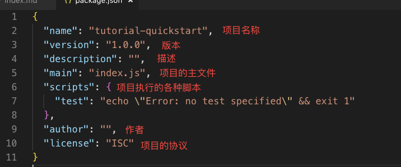
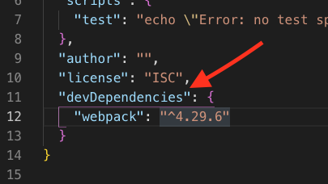
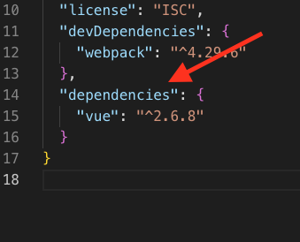
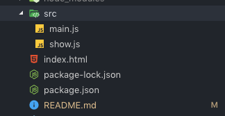
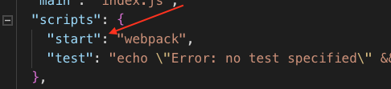
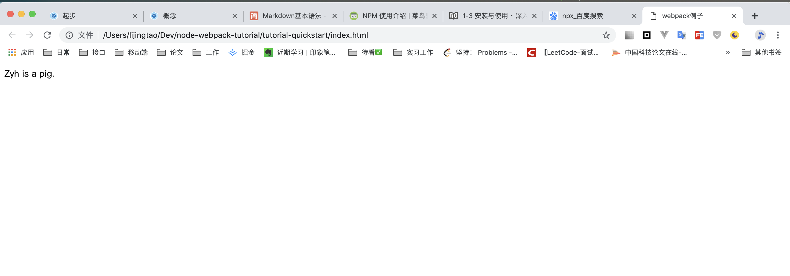

按这个教程做一遍，差不多就会npm和webpack的基础知识了，可以知道它们都是做什么的。

# 0. node
node是本地环境下的JavaScript运行环境，你应该已经装好了，这部分不再赘述。

# 1. npm
npm是随同node一起安装的包管理工具，用来管理前端需要使用的各种包(依赖)。

## 使用方法：
1 打开命令行，新建一个文件夹，然后进入这个文件夹:
```
mkdir tutorial-quickstart
cd tutorial-quickstart
```

2 运行命令，初始化npm的配置文件。

这里会让你输入很多基本信息，比如package name-项目名称，version-版本，等等等，可以直接一路按Enter
```
npm init
``` 
结束后，你会发现生成了一个package.json文件，这个文件就是用来配置前端项目的依赖的。



现在我们来安装一个包，webpack

```
npm install webpack --save-dev
```
install即安装的意思，这里的--save指安装包之后，在package.json中进行记录。
  
-dev指安装的包是在开发的时候使用，不用于生产环境。

安装完可以看到package.json里面多了一项，即我们安装的webpack。

因为我们指定在开发时候使用此包，所以它在devDependencies属性中。



现在再试着直接安装一个包，vue

```
npm install --save vue
```

可以看到这次没指定-dev，直接安装在dependencies中。



文件夹下生成的node_modules保存了所安装的包。

# 2. webpack
浏览器本身没有模块系统。不支持像node一样的模块化开发。

所以就需要一个前端项目构建器，或者打包工具，将模块化开发的代码打包成浏览器可以执行的代码。这时webpack粗现了。

webpack是一个Js应用程序的模板打包工具。即将js模块、或者css、静态资源打包成bundle的工具。（可以这么简单理解）

因为已经安装了webpack，现在介绍如何用。

首先在文件夹下新建index.html，以及src/main.js、show.js，目录结构如下：


在show.js写点代码：
```js
// 操作 DOM 元素，把 content 显示到网页上
function show(content) {
  window.document.getElementById('app').innerText = content;
}

// 通过 CommonJS 规范导出 show 函数
module.exports = show;
```

在index.js引入show.js导出的模块，并执行函数：
```
// 通过 CommonJS 规范导入 show 函数
const show = require('./show.js');
// 执行 show 函数
show('Zyh is a pig.');
```

因为浏览器环境下是没有模块系统的，我们要在index.html中引入这两个js文件肯定无法执行。require('xxx')浏览器不认识。

所以我们需要让webpack帮我们打包一下，将两个js文件打包成一个普通的js文件，给index.html使用。

## 1 新建配置文件
新建一个webpack.config.js文件，这个是webpack的配置文件。

然后在里面写如下内容：
```js
const path = require('path');

module.exports = {
  // JavaScript 执行入口文件
  entry: './main.js',
  output: {
    // 把所有依赖的模块合并输出到一个 bundle.js 文件
    filename: 'bundle.js',
    // 输出文件都放到 dist 目录下
    path: path.resolve(__dirname, './dist'),
  }
};
```
`path`是node用来处理路径的一个自带的包。

`module.exports`的主要内容：

`entry`指执行入口文件，webpack把这个文件视为入口。因为main.js里引入了show.js中的模块，所以webpack就会把show.js中的内容一起打包起来。

`output`即输出，控制webpack输出的内容。

`filename`即输出打包后的js的文件名。

`path`即文件输出的路径。`__dirname`是node的变量，可以取到当前文件所在目录。

所以`path.resolve(__dirname, './dist')`即将打包后的文件输出到`webpack.config.js`这个文件同级的dist文件夹下。

## 2 开始打包
为了使用webpack的命令行工具，需要再安装webpack-cli：
```
npm install --save-dev webpack-cli
```

然后在package.json的script属性中加入一行：
```
"start": "webpack --config webpack.config.js",
```





这一行的意思是，我在命令行中输入`npm start`执行时，npm会帮你执行后面的`webpack`命令

`webpack`意思即使用webpack，进行打包，webpack打包读取的配置文件为当前目录下的webpack.config.js配置文件。

打包后可以发现，文件夹下面多了dist文件夹，里面有bundle.js，它是打包好的文件。

## 3 引入打包后的文件
现在我们在index.html中引入这个打包后的文件：
```html
<!DOCTYPE html>
<html lang="en">
<head>
  <title>webpack例子</title>
</head>
<body>
  <div id="app"></div>
  <script src="./dist/bundle.js"></script>
</body>
</html>
```

打开网页，发现结果显示如下：



可能的问题：

1 package-lock.json干嘛用的？

用一句话来概括很简单，就是锁定安装时的包的版本号，并且需要上传到git，以保证其他人在npm install时大家的依赖能保证一致。
npm自动生成的，不用管它。

本教程完成后的示例代码在tutorial-quickstart文件夹下。
