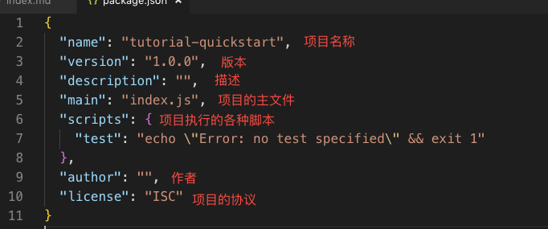
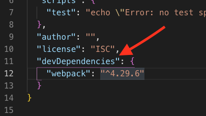
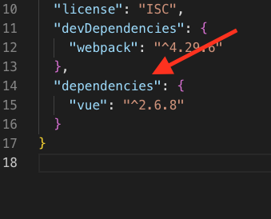
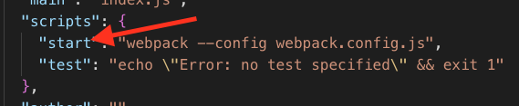
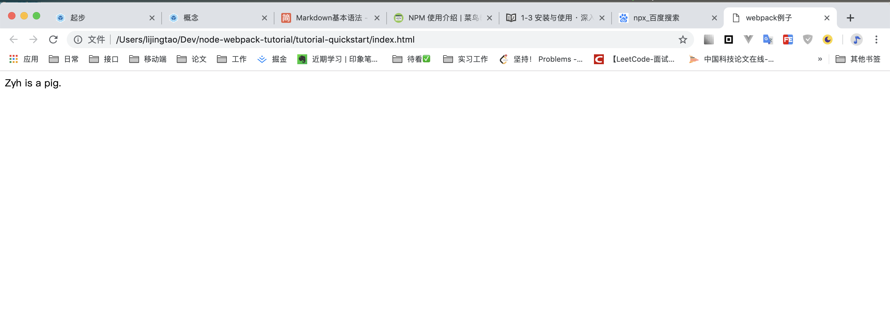

按这个教程做一遍，差不多就会 npm 和 webpack 的基础知识了，可以知道它们都是做什么的。

# 0. node

node 是本地环境下的 JavaScript 运行环境，你应该已经装好了，这部分不再赘述。

# 1. npm

npm 是随同 node 一起安装的包管理工具，用来管理前端需要使用的各种包(依赖)。

## 使用方法：

1 打开命令行，新建一个文件夹，然后进入这个文件夹:

```
mkdir tutorial-quickstart
cd tutorial-quickstart
```

2 运行命令，初始化 npm 的配置文件。

这里会让你输入很多基本信息，比如 package name-项目名称，version-版本，等等等，可以直接一路按 Enter

```
npm init
```

结束后，你会发现生成了一个 package.json 文件，这个文件就是用来配置前端项目的依赖的。



现在我们来安装一个包，webpack

```
npm install webpack --save-dev
```

install 即安装的意思，这里的--save 指安装包之后，在 package.json 中进行记录。

-dev 指安装的包是在开发的时候使用，不用于生产环境。

安装完可以看到 package.json 里面多了一项，即我们安装的 webpack。

因为我们指定在开发时候使用此包，所以它在 devDependencies 属性中。



现在再试着直接安装一个包，vue

```
npm install --save vue
```

可以看到这次没指定-dev，直接安装在 dependencies 中。



文件夹下生成的 node_modules 保存了所安装的包。

# 2. webpack

浏览器本身没有模块系统。不支持像 node 一样的模块化开发。

所以就需要一个前端项目构建器，或者打包工具，将模块化开发的代码打包成浏览器可以执行的代码。这时 webpack 粗现了。

webpack 是一个 Js 应用程序的模板打包工具。即将 js 模块、或者 css、静态资源打包成 bundle 的工具。（可以这么简单理解）

因为已经安装了 webpack，现在介绍如何用。

首先在文件夹下新建 index.html，以及 src/main.js、show.js，目录结构如下：


在 show.js 写点代码：

```js
// 操作 DOM 元素，把 content 显示到网页上
function show(content) {
  window.document.getElementById('app').innerText = content;
}

// 通过 CommonJS 规范导出 show 函数
module.exports = show;
```

在 main.js 引入 show.js 导出的模块，并执行函数：

```
// 通过 CommonJS 规范导入 show 函数
const show = require('./show.js');
// 执行 show 函数
show('Zyh is a pig.');
```

因为浏览器环境下是没有模块系统的，我们要在 index.html 中引入这两个 js 文件肯定无法执行。require('xxx')浏览器不认识。

所以我们需要让 webpack 帮我们打包一下，将两个 js 文件打包成一个普通的 js 文件，给 index.html 使用。

## 1 新建配置文件

新建一个 webpack.config.js 文件，这个是 webpack 的配置文件。

然后在里面写如下内容：

```js
const path = require('path');

module.exports = {
  // JavaScript 执行入口文件
  entry: './main.js',
  output: {
    // 把所有依赖的模块合并输出到一个 bundle.js 文件
    filename: 'bundle.js',
    // 输出文件都放到 dist 目录下
    path: path.resolve(__dirname, './dist')
  }
};
```

`path`是 node 用来处理路径的一个自带的包。

`module.exports`的主要内容：

`entry`指执行入口文件，webpack 把这个文件视为入口。因为 main.js 里引入了 show.js 中的模块，所以 webpack 就会把 show.js 中的内容一起打包起来。

`output`即输出，控制 webpack 输出的内容。

`filename`即输出打包后的 js 的文件名。

`path`即文件输出的路径。`__dirname`是 node 的变量，可以取到当前文件所在目录。

所以`path.resolve(__dirname, './dist')`即将打包后的文件输出到`webpack.config.js`这个文件同级的 dist 文件夹下。

## 2 开始打包

为了使用 webpack 的命令行工具，需要再安装 webpack-cli：

```
npm install --save-dev webpack-cli
```

然后在 package.json 的 script 属性中加入一行：

```
"start": "webpack",
```



这一行的意思是，我在命令行中输入`npm start`执行时，npm 会帮你执行后面的`webpack`命令

`webpack`意思即使用 webpack，进行打包，webpack 打包读取的配置文件为当前目录下的 webpack.config.js 配置文件。

打包后可以发现，文件夹下面多了 dist 文件夹，里面有 bundle.js，它是打包好的文件。

## 3 引入打包后的文件

现在我们在 index.html 中引入这个打包后的文件：

```html
<!DOCTYPE html>
<html lang="en">
  <head>
    <title>webpack例子</title>
  </head>
  <body>
    <div id="app"></div>
    <script src="./dist/bundle.js"></script>
  </body>
</html>
```

打开网页，发现结果显示如下：



可能的问题：

1 package-lock.json 干嘛用的？

用一句话来概括很简单，就是锁定安装时的包的版本号，并且需要上传到 git，以保证其他人在 npm install 时大家的依赖能保证一致。
npm 自动生成的，不用管它。

本教程完成后的示例代码即 tutorial-quickstart 文件夹里的代码。
