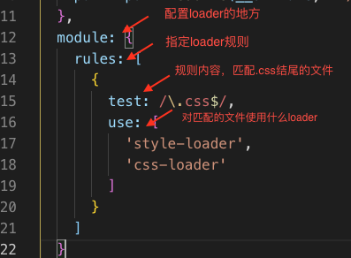
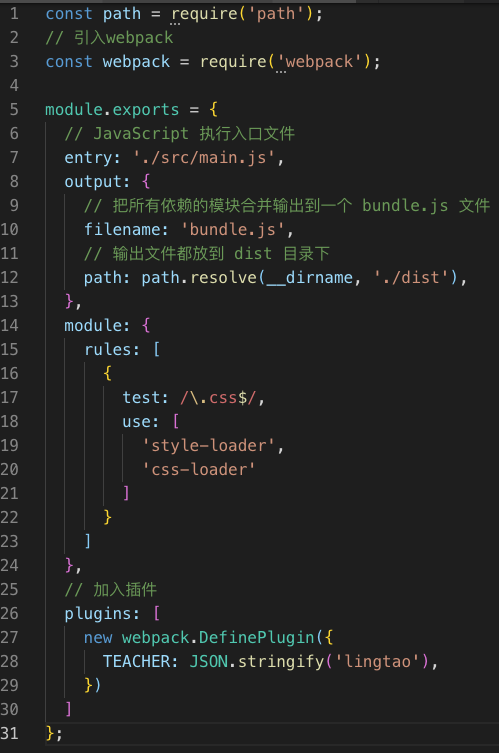

# 0 写在前面的小知识点
## ES6模块化支持
 因为webpack已经内置支持的ES6的模块化语法，即import/export。

所以我们现在修改CommonJs规范的模块化语句，改为ES6的模块化语句。

在main.js中：
```js
module.exports = show;
// 改为
export { show };
```

show.js中：
```js
const show = require('./show.js');
// 改为
import { show } from './show.js'
```

然后再次运行`npm start`进行打包。发现打包成功，执行结果相同。

## package.json中scripts的配置

然后，在package.json中，我们之前使用`npm start`执行了webpack的打包。

但是`npm start`一般都是执行应用程序的时候才会使用的命令，所以我们加入一个`build`命令去进行webpack的打包。

修改package.json，在scripts加入一行，然后删除start后面的内容：
```json
"scripts": {
    "start": "",
    "build": "webpack",
    "test": "echo \"Error: no test specified\" && exit 1"
  },
```


注意，除了`npm start`命令之外，执行package.json中的scripts需要在npm命令后面加`run`。

所以这里，在命令行中执行`npm run build`即可执行`webpack`命令进行打包。

同理，以后要用到其他复杂的命令时，可以在package.json的scripts中自己写入。

# 1 webpack的**loader**
在quickstart部分里，我们接触了webpack的**entry**和**output**，即**入口**和**输出**的概念。现在了解一下**loader**。

loader可以理解成webpack用来加载各种资源的处理器。

通过在webpack.config.js中配置不同的loader来处理不同的文件。作为例子，现在来配置一个loader处理css。

处理css需要`style-loader`和`css-loader`，这是两个依赖包，所以要先安装：
```
npm install --save-dev style-loader css-loader
```

然后在配置文件中进行配置，加入新的内容：
```js
...
 path: path.resolve(__dirname, './dist'),
},
// loader的配置内容
module: {
    rules: [
      {
        // 使用的正则表达式
        test: /\.css$/,
        use: [
          'style-loader',
          'css-loader'
        ]
      }
    ]
  }
};
```
具体解释如图所示：



所以配置了这条规则之后，我们就指定了webpack在处理.css结尾的文件时，使用`style-loader`和`css-loader`。

现在我们可以在js中引入css文件了。我们先在src文件夹下新建`index.css`，然后加入代码：
```css
#app {
  color: red;
}
```

然后在main.js头部加入：
`import './style/index.css';`

再次进行打包，打开index.html，可以看到文字颜色变红。

# 2 webpack的**plugin**
在输入、输出、loader三个概念之后，plugin-插件是另外一个重要的概念。

插件的主要功能是执行一系列执行范围更广的任务。我们以DefinePlugin为例解释如何配置：

---

DefinePlugin是webpack一个内置的插件，可以直接使用。作用是创建一个在编译时可以配置的全局常量。

即配置一个常量在所有js文件中都可以使用。

我们在webpack配置文件中开始配置，在头部引入webpack：
```js
const webpack = require('webpack');
```

在配置中加入以下内容：
```js
// 配置插件的位置
plugins: [
    // 使用DefinePlugin插件
    new webpack.DefinePlugin({
      // 声明一个全局常量，名为TEACHER，值为lingtao
      TEACHER: JSON.stringify('lingtao'),
    })
  ]
```

配置后webpack配置文件的内容：



注意此插件引入字符串的时候，需要JSON.stringfy转一下。

下面来试一下，更改show.js，使用一下TEACHER变量：
```js
// 操作 DOM 元素，把 content 显示到网页上
function show(content) {
  // 使用全局变量TEACHER
  content += 'Her teacher is:' + TEACHER;
  window.document.getElementById('app').innerText = content;
}

export { show };
```

重新打包，看到屏幕上的内容已经变成了:
`Zyh is a pig.Her teacher is:lingtao`。即后面的`TEACHER`变量替换为为我们配置的lingtao。

本节完成后的示例代码在tutorial-webpack-basics即本文件夹中。

文档资源：
1. webpack中文官方文档：https://webpack.docschina.org/
2. 常见loader配置官方文档：https://webpack.docschina.org/guides/asset-management/
3. 使用的DefinPlugin官方文档：https://webpack.docschina.org/plugins/define-plugin/